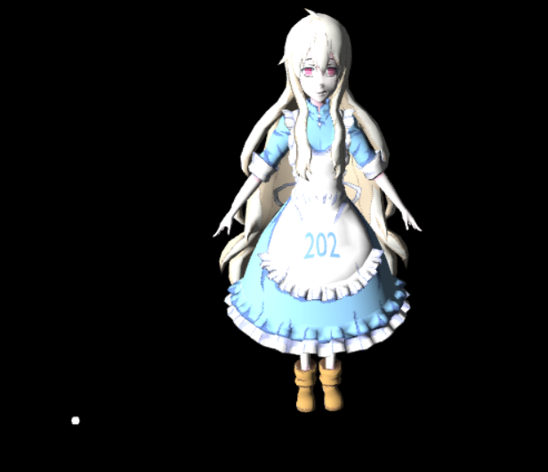
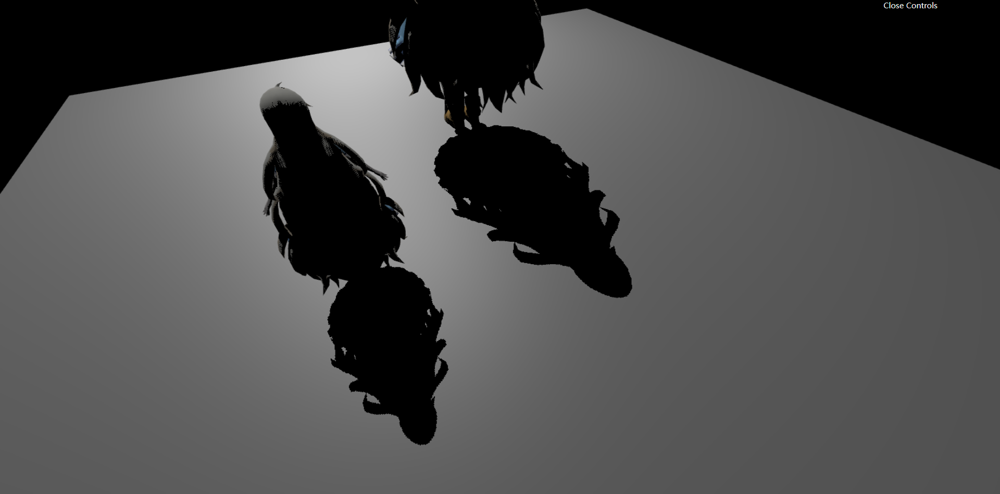
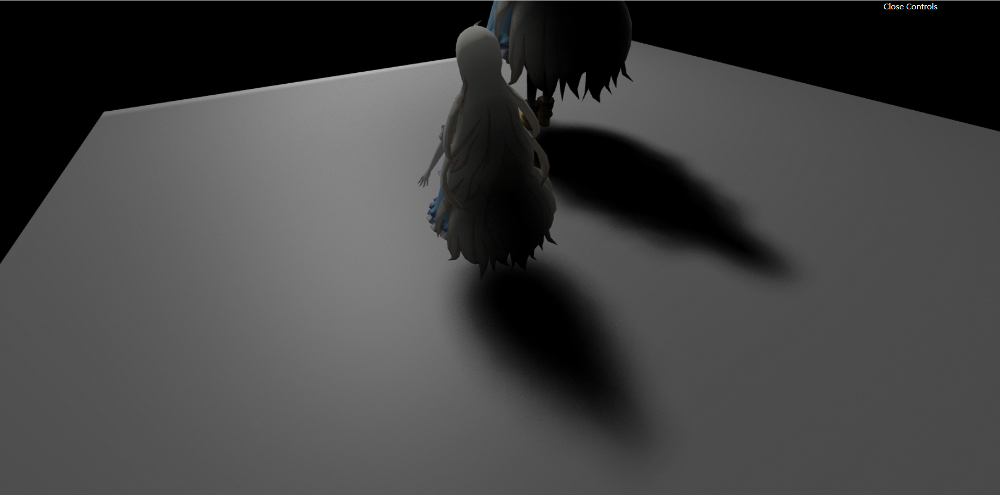
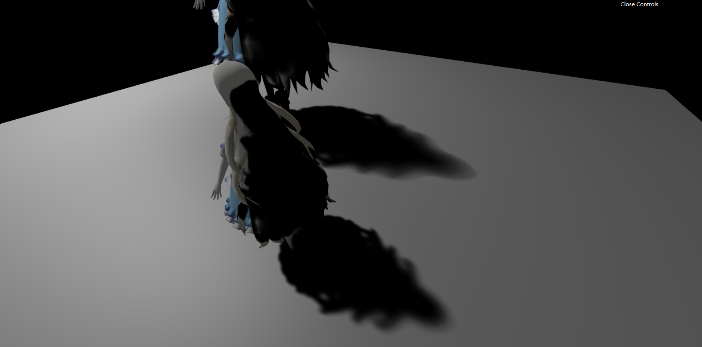

# GAMES202 课程作业

课程主页：[https://sites.cs.ucsb.edu/~lingqi/teaching/games202.html](https://sites.cs.ucsb.edu/~lingqi/teaching/games202.html)

## 作业结果截图

    
<strong>作业 0</strong>

    <table><tr>
        <td>
    		
        </td>
    </tr></table>

    
<strong>作业 1</strong>

    <table><tr>
        <td>
            
            
Shadow Map

        </td>
        <td>
            
            
PCF

        </td>
        <td>
            
            
PCSS

        </td>
    </tr></table>

